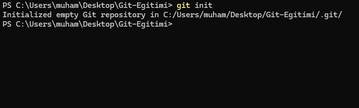
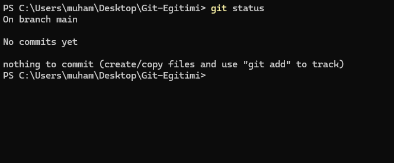
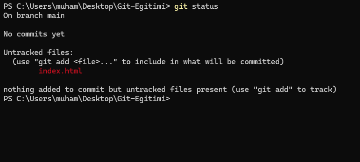
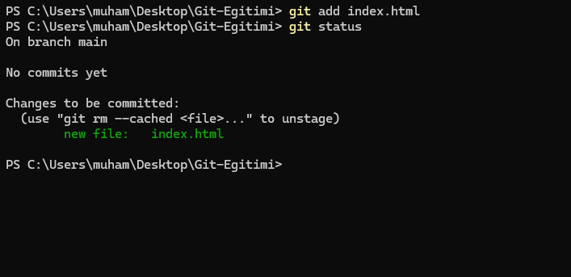
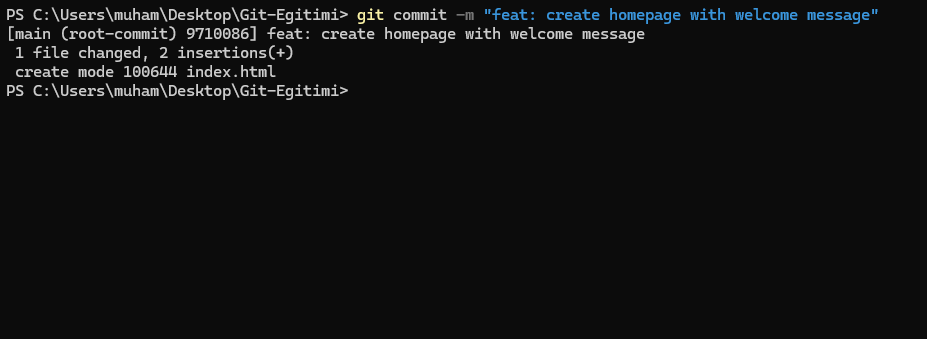
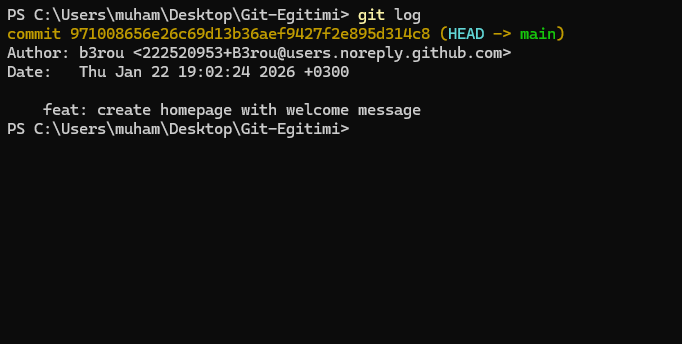

# 1.2 - İlk Temas: Evreni Yaratmak 🌌

> *"Her büyük yolculuk, atılan o ilk küçük adımla değil; o adımı atma cesaretiyle başlar."*

Teori bitti. Artık pilot koltuğundasın. Bu derste, bilgisayarımızdaki sıradan bir klasörü, zaman yolculuğu yapabilen güçlü bir Git deposuna (Repository) dönüştüreceğiz. Artık kursumuzun devamında "Depo" yerine teknik terim olan **Repo** kelimesini kullanacağız.

---

> [!WARNING]
> ## ⚠️ Hatırlatma: Kimlik Ayarları
> Eğer bilgisayarında Git'i ilk kez kullanıyorsan, Git sana "Sen kimsin?" diye soracaktır. <br>
> Önceki dersimizde detaylıca incelemiştik lâkin bu aşama gözden kaçmamalı. Lütfen ayarı yapmadıysan terminale şunları gir:
> ```bash
> git config --global user.name "Adin Soyadin"
> git config --global user.email "email@adresin.com"
> ```
> *Bu ayarı bilgisayarında sadece bir kere yapman yeterlidir. Eğer eksiğin varsa, lütfen önceki dersimize göz at*

> "Bazen başarıya giden kestirme yolu aramakla o kadar meşgul oluruz ki; zaten önümüzde duran, taşları titizlikle döşenmiş asıl yolun ne kadar kısa ve verimli olduğunu göremeyiz." ~Eğer yeniysen lütfen sürece güven ve kestirme yollar arayarak vakit kaybetme. 💜

---

## Görev 1: Big Bang (git init)

Burası senin Reponun doğuşu olacak. Git'in bundan sonra takibini yapmasını istediğin bir klasörü (directory) Git'e tanıtalım:

1. Masaüstünde veya projelerini tuttuğun yerde `git-egitimi` adında boş bir klasör oluştur.
2. Terminalini (veya VS Code terminalini) aç ve bu klasörün içine gir.

<details>
<summary>❓ <b>Terminalde klasörün içine nasıl girerim? (2 Yöntem)</b></summary>
<br>

**Yöntem 1: En Kolayı (Önerilen)**
Klasörün içine gir, boş bir yere **Sağ Tıkla** ve şuna benzer seçeneği seç:
* Windows: *"Open in Terminal"* veya *"Git Bash Here"*
* Mac: *"New Terminal at Folder"* (Ayarlardan açılması gerekebilir)
* VS Code: Klasörü VS Code ile açıp `Ctrl + é` (veya `Cmd + J`) ile terminali aç.

**Yöntem 2: Hacker Yolu (`cd` Komutu)**
`cd` (Change Directory) komutu ile klasörler arasında gezebilirsin.
* **Windows:** `cd C:\Users\KullaniciAdi\Desktop\git-egitimi`
* **Mac/Linux:** `cd ~/Desktop/git-egitimi`

> **İpucu:** `cd` yazıp bir boşluk bıraktıktan sonra klasörü tutup terminalin içine sürüklersen, yol otomatik yazılır!
</details>

Şu an klasörün Git için hala sadece "sıradan bir klasör". Git'in ruhunu bu klasöre üflemek için şu sihirli sözcüğü yaz:

```bash
git init
```

Terminal sana şuna benzer bir cevap verecektir:

> *Initialized empty Git repository in .../git-egitimi/.git/*



🎉 **Tebrikler!** Artık bu klasör sıradan değil. İçinde gizli bir `.git` klasörü oluşturuldu ve Git, buradaki her hareketi izlemeye başladı.

---

## 🧭 Görev 2: Durum Kontrolü (git status)

Git dünyasında kaybolmamanın en büyük sırrı, sürekli pusulaya bakmaktır. O pusulanın adı: `git status`.

Hemen deneyelim:

```bash
git status
```

Çıktı şöyle olmalı:

```text
On branch main
No commits yet
nothing to commit (create/copy files and use "git add" to track)
```



**Meali:** "Şu an `main` (ana) daldasın. Henüz hiç commit (snapshot) eklemedin. Ortada kaydedilecek bir dosya da yok."

<details>
<summary>❓ <b>Bende main yerine master yazıyor?</b></summary>
<br>

Merak etme! Git'in eski sürümlerinde varsayılan dal (branch) adı `master` idi. Ancak, daha kapsayıcı bir dil kullanma çabasıyla, Git topluluğu 2020 yılında varsayılan dal adını `main` olarak değiştirdi. Yine de git, sen belirtilmedikçe ilk branchını her zaman `master` olarak oluşturur. <br>

Branchları henüz öğrenmedik, bu yüzden kafanı karıştırmasın. Sadece bil ki `main` veya `master` gördüğünde aynı şeyi kastettiğimizi anla. <br>

Eğer istersen, mevcut branch adını `main` olarak değiştirebilirsin. Bunu yapmak için terminale şunu yaz:

```bash
git branch -M "main"
```

Ayrıca bir daha bu sorunla karşılaşmamak için Git'in varsayılan branch adını `main` yapabilirsin. Bunu yapmak için terminale şunu yaz:

```bash
git config --global init.defaultBranch "main"
```

Hadi Devam Edelim! 
</details>

---

## 📄 Görev 3: İlk Dosyayı Yaratmak

Hadi Git'e iş çıkaralım. Klasörün içinde `index.html` adında bir dosya oluştur ve içine şunları yaz (veya kopyala):

```html
<h1>Merhaba Git!</h1>
<p>Şu anda senle beraber B3rou'nun eğitimine tabiiyiz. Hadi birbirimizi daha yakından tanıyalım!</p>
```

Dosyayı kaydet ve tekrar pusulaya bak:

```bash
git status
```

**Dikkat!** Yazılar kırmızı renkte mi? 🔴

> *Untracked files: index.html*



Git diyor ki: *"Patron, yeni bir dosya gördüm ama bunu takip listeme almadım. Bu dosya şu an benim korumam altında değil (Untracked)."*

---

## 📦 Görev 4: Sahneye Almak (git add)

1.1 dersindeki "Kargo Paketleme Masası"nı hatırladın mı? Dosyayı commit'lemeden (kargolamadan) önce zarfa koymamız lazım.

```bash
git add index.html
```

Hiçbir hata mesajı almadıysan, işlem başarılıdır. Emin olmak için **her zaman** tekrar kontrol et:

```bash
git status
```

Yazılar **Yeşil** olduysa harika! 🟢

> *Changes to be committed: new file: index.html*



Artık dosya "Staging Area"da. Zarfın içinde ve mühürlenmeye hazır.

---

## 📸 Görev 5: Tarihe Not Düşmek (git commit)

Artık anı ölümsüzleştirebilirsin. Zarfı kapatıp, üzerine ne yaptığımızı anlatan bir not yapıştırarak postaya veriyoruz.

```bash
git commit -m "feat: create homepage with welcome message"
```

* `git commit`: Kaydetme emri.
* `-m`: "Mesajım var" parametresi.
* `"..."`: Tırnak içinde ne yaptığını **net** bir şekilde yaz.

> Commit mesajları, projenin geçmişini aydınlatan sayfaların olacaktır. Commitlerini bunun bilincinde olup atmalısın.

Terminal sana şöyle bir özet geçecek:

> *[main (root-commit) 9710086] feat: create homepage with welcome message* <br>
> *1 file changed, 2 insertions(+)*  <br>
> *create mode 100644 index.html*



<details>
<summary>❓ <b>"feat: create homepage with welcome message" da ne demek?</b></summary>
<br>

Aslında commit mesajlarının syntax'ı (yapısı) konusunda kesin bir kural yoktur. Ancak, iyi bir commit mesajı yazmak, projenin geçmişini anlamak ve işbirliği yapmak için çok önemlidir. <br>
Bu yüzden en çok kullanılan ve önerilen bir formatı kullandım. <br><br>

Daha sonra temiz commitlerin nasıl atılması gerektiği konusuna değineceğim. Ama şimdiden merak edersen eğer işte kaynağım: [Conventional Commits](https://www.conventionalcommits.org/en/v1.0.0/).
</details>

---

## 📜 Görev 6: Günlüğü Okumak (git log)

Bakalım tarihe gerçekten geçmiş miyiz? Git'in seyir defterini açalım:

```bash
git log
```



Karşına çıkan bu ekran, projenin kimlik kartıdır:

1. **Commit Hash:** O sarı renkli uzun kod (SHA-1).
2. **Author:** Bunu kim, ne zaman yaptı?
3. **Date:** Commit ne zaman atıldı?
4. **Message:** Ne yaptı?

*(Log ekranından çıkmak için `q` tuşuna basabilirsin).*

---

## Özet ve Yeni Yetenekler

Bu derste şu **"Muhteşem Döngü"**yü öğrendin:

1. Kod Yaz, Dosyalarını oluştur, Sürümünü Tamamla ✍️
2. `git status` (Kırmızı mı?) 🔴
3. `git add` (Yeşil yap!) 🟢
4. `git commit` (Fotoğrafı çek!) 📸

> [!TIP]
> **Hızlı Ekleme:** <br> 
> Aslında her seferinde 1 dosyayı stagelemek zorunda değilsin.  <br>
> * `git add .` komutu, klasördeki **tüm** değişiklikleri tek seferde stage eder. <br>
> * Pratik bir şekilde yaptığın tüm değişiklikleri sahneleyip commitlemek sık yapılan bir eylemdir. <br>

> [!TIP]
> **Yeni Yetenek Kilidi Açıldı: `git status`** <br>
> * Git'in gördükleri, (Working Directorydeki değişiklikleri, indexi vs) rapor eder. <br><br>
> Daha fazla komut için [git status komutları listesine](https://git-scm.com/docs/git-status) bakabilirsin.

> [!TIP]
> **Yeni Yetenek Kilidi Açıldı: `git add`** <br>
> * `.` veya `--all`: Tüm yaptığın değişiklikleri stageler ve index'e ekler. <br>
> * `file.c`: Spesifik bir dosyayı veya dizini seçip index'e eklersin. <br><br>
> Daha fazla komut için [git add komutları listesine](https://git-scm.com/docs/git-add) bakabilirsin.

> [!TIP]
> **Yeni Yetenek Kilidi Açıldı: `git commit`** <br>
> * `-m "mesaj"`: Belirlediğin mesaj ile beraber index'e eklediğin dosyaların fotoğrafını çeker ve onu repoya ekler. <br><br>
> Daha fazla komut için [git commit komutları listesine](https://git-scm.com/docs/git-commit) bakabilirsin.

> [!TIP]
> **Yeni Yetenek Kilidi Açıldı: `git log`** <br>
> * Reponun commitlerini sırasıyla gösterir. Projenin Tarihçesidir. <br><br>
> Daha fazla komut için [git log komutları listesine](https://git-scm.com/docs/git-log) bakabilirsin.

Bir sonraki dersimizde daha sağlıklı bir şekilde tüm dosyaları stagelemeyi öğreneceksin.

👉 **O halde hazırsan, devam ediyoruz:** [1.3 - Git Ignore: Görmezden Gelme Sanatı](./1.3-gitignore.md)