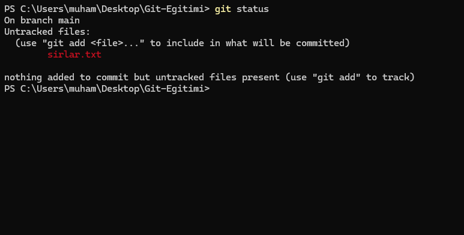
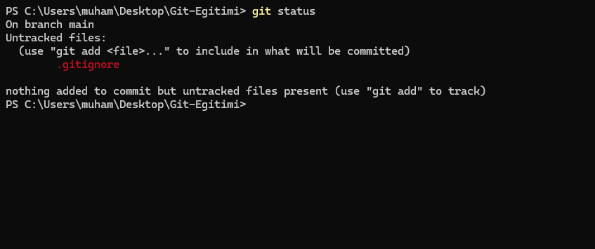

# 1.3 - Git Ignore: Görmezden Gelme Sanatı

Git, varsayılan olarak klasördeki her değişikliği sana rapor eder. Ancak bazı dosyalar vardır ki, onları ne repoda saklamak istersin ne de her `git status` yazdığında o kalabalığı görmek.

## 1. Neden Bazı Dosyaları Gizleriz?

Her dosyayı repoya atmak sadece yer kaplamaz, aynı zamanda profesyonelliğe aykırıdır:
* **Gereksiz Yük:** Binlerce dosyalık kütüphane klasörleri (Örn: `node_modules`, `vendor`).
* **Sistem Dosyaları:** İşletim sisteminin otomatik oluşturduğu kalıntılar (Örn: `.DS_Store`, `Thumbs.db`).
* **Derlenmiş Dosyalar:** Kodun kendisi değil, çıktısı olan dosyalar (Örn: `.exe`, `.o`, `.class`).
* **Özel Veriler (⚠️ KRİTİK!):** API anahtarları, şifreler veya kişisel ayarların olduğu `.env` dosyaları. Bunlar Repoya/GitHub'a düşerse projen ve güvenliğin tehlikeye girer.

> **Hatırla Git'in Distributed (Dağıtık) Felsefesi:** <br>
> *"'Git'te ise **herkes bir yedektir.'** Projeyi kendi bilgisayarına cloneladığın (indirdiğin) an, projenin **1. günden bugüne kadar olan tüm tarihçesini, tüm versiyonlarını ve tüm veritabanını** indirirsin."*

---

## Görev 1: Filtreyi Oluşturmak

Git'e "bunlara bakma" demek için projenin ana dizinine `.gitignore` adında özel bir dosya oluşturmamız gerekir.
> *Evet; dosyanın adı yok, başında nokta var ve bu bir uzantı.*

Hadi test edelim:

1. Proje klasörünün içinde `sirlar.txt` diye bir dosya oluştur ve içine "Çok gizli şifrelerim" yaz.
2. Terminale `git status` yaz. Dosya **kırmızı** görünecek (Untracked).



Şimdi Git'in gözlerini bağlayalım:

1. Projenin en dış klasöründe (bu klasöre **root** denir) `.gitignore` adında bir dosya oluştur.
2. Bu dosyanın içine sadece şunu yaz ve kaydet:
```text
   sirlar.txt
```

> Burada Git'e *".gitignore'da yazan tüm dosyaları, root dizin dahil olmak üzere görmezden gel"* diyoruz.

3. Tekrar terminale `git status` yaz.



**Büyü!** ✨ `sirlar.txt` artık listede yok. Git artık o dosya orada olsa bile onu **görmezden geliyor.**

> Onun yerine `.gitignore`'u göreceksin. Git, `.gitignore`'u tanıdı ve istediğin dosyaları dışladı. Lâkin henüz commitlenmediği için `.gitignore` dosyası, henüz projenin hiçbir commitinde (fotoğrafında) yok. Commitleyerek bu kurallar kitabını reponda kalıcılaştırabilirsin.

---

## Yaygın Kullanım Kalıpları (Syntax)

`.gitignore` dosyasının kendine has bir dili vardır. İşte en sık kullanacağın kalıplar:

```gitignore
# 1. Belirli bir dosyayı gizle
config.json

# 2. Uzantıya göre gizle (Yıldız * = Her şey demektir)
*.log       # Sonu .log ile biten her şeyi gizle
*.tmp       # Geçici dosyaları gizle
*.exe       # Derlenmiş exe dosyalarını gizle

# 3. Klasörleri gizle (Sonuna / koyulur)
node_modules/
temp/
build/

# 4. İstisna Yapmak (Ünlem ! = Bunu gizleme)
# Tüm .log dosyalarını gizle ama...
*.log
# ...important.log dosyasını hariç tut (göster)
!important.log

# 5. Dosya içerisinde kontrol
# Dosyaların hepsini gez ve eşleşenleri gizle
**/mycode.c

```

#### 🔍 Close-Case Tablosu:

| Kural | Açıklama |
| --- | --- |
| `mycode.c` | Projenin **her yerindeki** `mycode.c` dosyalarını gizler. |
| `/mycode.c` | Sadece **root (kök)** dizindeki `mycode.c` dosyasını gizler. |
| `**/mycode.c` | Herhangi bir alt klasördeki `mycode.c`'yi gizler (1. kural ile aynıdır). |
| `debug/*.log` | `debug` klasöründeki logları gizler ama `debug/internal/test.log`'u **gizlemez**. |
| `debug/**/*.log` | `debug` klasörü ve onun **tüm alt klasörlerindeki** logları gizler. |

---

## Acil Durum: Yanlışlıkla Commit Ettim! (Cache Temizliği)

Bu, yazılımcıların en sık yaşadığı senaryodur:

1. Bir dosyayı yanlışlıkla `git add .` diyerek sahneye atarsın (hatta commitlersin).
2. Sonra "Eyvah, bu gizliydi!" diyip hemen `.gitignore` dosyasına eklersin.
3. Ama `git status` yapınca Git hala o dosyayı takip eder!

**Neden?**
Çünkü `.gitignore`, Git dünyasının **Kapı Güvenliğidir.** 👮‍♂️

* Dosyalar henüz kapıdayken (Untracked) `.gitignore` onları durdurabilir.
* Ancak bir dosya `git add` ile kapıdan içeri girdiyse, Git artık ona **"Bizden Biri"** muamelesi yapar. İçerideki adam için güvenlik kontrolü yapılmaz.

İşte `git rm --cached` komutu tam burada devreye girer. Bu komut Git'e şunu söyler:

> *"Bu dosyayı tanıdığını unut ve onu kapının önüne geri koy."*

Böylece dosya tekrar içeri girmek istediğinde, elindeki `.gitignore` listesine sahip güvenlik görevlisi onu bu sefer tanıyacak ve içeri almayacaktır.

**Çözüm:** 
Dosyayı **Git'in hafızasından (Index)** silmelisin ama **diskten (bilgisayarından)** silmemelisin.

Bunun için şu komutu kullanırız:

```bash
git rm --cached sirlar.txt

```

* `git rm`: Sil.
* `--cached <dosya-yolu>`: Sadece Index'ten (Git'in sahnesinden) sil, **dosyama dokunma.**

> [!CAUTION]
> **DİKKAT!**
> Bu kısım kritiktir. `--cached` argümanı, Git'in takibinden (track) silmeyi temsil eder. Koyulmadığı takdirde Git; tracki değil, **dosyanı bilgisayarından silecektir!**

Bu komutu yazdıktan sonra commit atarsan, dosya repodan silinir ama senin bilgisayarında (Working Directory) güvende kalır.

> [!WARNING]
> **Git Unutmaz!**
> Git; *"Depolama, emekten önemsizdir"* felsefesini taşır. Bu yüzden silindiğini sandığın çoğu şey, aslında revert edilebilir. <br>
> Eğer API keyini veya özel bir bilgini yanlışlıkla commit ettiysen endişelenme ama dikkatli ol, çünkü bu kodlar ve keyler geçmişten (history) geri getirilebilir! (Bunu ileride temizlemeyi öğreneceğiz).

---

## ✅ Kontrol Noktası

1. `.gitignore` dosyasını oluşturdun mu? (Adı tam olarak bu olmalı).
2. Gizlemek istediğin dosya yollarını doğru yazdın mı?
3. Eğer dosya inatla gitmiyorsa `git rm --cached` komutunu denedin mi?

---

## Özet ve Yeni Yetenekler

Bu derste sadece commit atmayı değil, **Repo Hijyeni** sağlamayı öğrendin. Yeni öğrendiğin komutlar sayesinde temel düzenlemelerin bazılarını yapabileceksin.

> [!TIP]
> **Yeni Yetenek Kilidi Açıldı: `.gitignore`**
> * Git'in takip etmesini istemediğin dosya ve klasörleri tanımladığın metin dosyasıdır.
> * Bulunduğu dosyadan başlayarak içerisindeki tüm dosyalara etki eder. Hiyerarşiktir.
> * Yani `/.gitignore` dosyası tüm projeyi kapsarken `/docs/.gitignore`, docs'u ve içerisindeki tüm directoryleri kapsar.
> * Genelde root directorye koyulur, çünkü tüm projede bu kuralların geçerli olması beklenir.
> * Bir projede birden fazla `.gitignore` dosyası kullanılabilir. <br><br>
> Daha da fazla detay için [.gitignore resmi açıklamasına](https://git-scm.com/docs/gitignore) bakabilirsin.

> [!TIP]
> **Yeni Yetenek Kilidi Açıldı: `git rm --cached`**
> * **Hayat Kurtarıcı:** Dosyayı fiziksel olarak silmeden, sadece Git'in takibinden (Staging Area) çıkarır. `.gitignore`'un çalışmadığı durumlarda ilk başvurulacak ilaçtır.

> [!NOTE]
> **Tam Temizlik: `git rm -r --cached .`**
> * Bu komutu kullanarak Git'in **tüm tracklerini (takip listesini)** silebilirsin. Merak etme, `--cached` argümanı dosyalarını korur.
> * `-r` argümanı, **recursive (yinelemeli)** demektir. Buradaki amacı tüm trackleri silene kadar işlemi alt klasörlerde tekrar etmektir.
> * Bu komutun kullanılma amacı; var olan trackler çok karışırsa ya da herkesi tekrar `.gitignore` süzgecinden geçirmek istersen kullanılır.
> * Ardından daha önce öğrendiğin `git add .` ile dosyalarını tertemiz bir şekilde tekrar trackleyebilirsin.

---

# 🎉 Bölüm Sonu: Genesis Tamamlandı

Tebrikler! Git öğrenme yolculuğunun ilk ve en önemli adımı olan **Genesis (Yaratılış)** modülünü başarıyla tamamladın. Artık sadece kod yazan birisi değil, **"neden?"** sorusunu soran ve cevaplarını arayan bir geliştiricisin.

### 🏆 Neler Başardın?
Bu modülde şunları heybene koydun:
- [x] **Kurulum:** Git'i bilgisayarına kurdun ve hangi konfigürasyonların kritik olduğunu tanıdın.
- [x] **Teori:** Git'in dosya farklarını değil, anlık görüntüleri (Snapshot) sakladığını anladın. Ayrıca git'in düşünce yapısını inceledin.
- [x] **Yaratılış:** `git init` ile sıradan bir klasöre ruh üfledin.
- [x] **Kayıt:** `add` ve `commit` ile tarihe silinmez notlar düştün.
- [x] **Hijyen:** `.gitignore` ile gereksiz veya kritik dosyaları kapıdan çevirmeyi öğrendin.

---

## 🚀 Sırada Ne Var?

Şu ana kadar güvenli bir limandaydık. Tek bir zaman çizgisinde (main), tek başımıza ilerledik.

Ama Git'in gerçek gücü **"Paralel Evrenler"** yaratabilmesidir.
Bir sonraki bölümde, çalışan kodunu bozmadan nasıl çılgın deneyler yapabileceğini, aynı anda birden fazla özellikle nasıl uğraşabileceğini ve ekibinle birbirinizi bozmadan geliştirme yapabileceğini öğreneceksin.

> [!IMPORTANT]
> Ama öncelikle kendini bir tebrik et! İnsanlar git'in genelde yalnızca `add` `commit` `push` komutlarını bilirken sen `add` ve `commit`'in detaylarını öğrendin ve gümbür gümbür geliyorsun! Bu motivasyonunu kaybetme! 💜

Hazırsan, evreni bölmeye gidiyoruz.

👉 **Bölüm 2, Multiverse'e Başla:** [2.0 - Multiverse: Branch Anatomisi](../2-multiverse/2.0-branch-mantigi.md) <br>

👉 **Bu Bölümde Yetenek Ağacına Neler Ekledin:** [1.4 - Yetenek Ağacım: Bölüm Özeti](./1.4-bolum-ozeti.md) <br>

👉 **Biraz Soluklanmak İstersen :** [0.0 - Ana Sayfaya Dön: Root README](../../README.md)