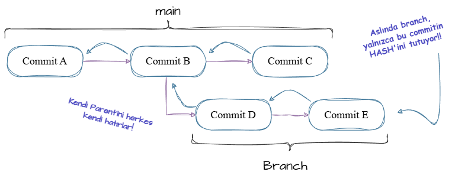
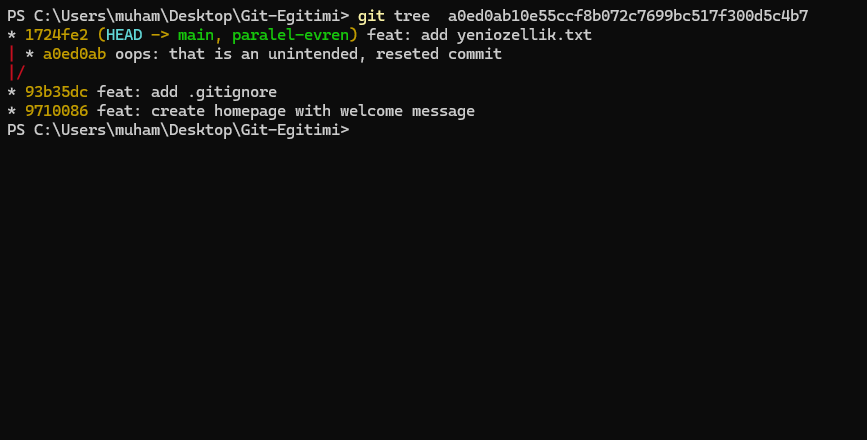

# 2.0 - Multiverse: Branch Anatomisi 🌌

> *"Main branch üzerinde çalışmak, pimi çekilmiş el bombasıyla oynamak gibidir. Branch açmak ise o bombayı güvenli bir test odasına kilitlemektir."*

Şu ana kadar **Genesis** modülünde "tek şeritli bir yolda" (main) ilerledik. Bu kulağa basit gelse de aslında **tehlikeliydi**. Çünkü o tek çizgide yapacağın hatalı bir commit, projenin çalışan halini bozabilirdi.

Gerçek bir mühendis; çalışan kodu (Production) riske atmadan **çılgın deneyler** yapmak, yeni özellikler eklemek veya bir hatayı (bug) düzeltmek istediğinde kendine **"İzole Bir Evren"** yaratır. İşte Git'te buna **Branching (Dallanma)** diyoruz.

Asıl güvenli liman burasıdır; çünkü burada yaptığın hiçbir şey ana projeyi sen istemedikçe etkilemez! Yani sen özgürce üzerinde oynama yapabilir, commit atabilir ve kayıt almaya devam edebilirsin. Dilediğin vakitte ise bu eklemelerini ana çizgiye ekleyebilir, ya da hoşuna gitmezse bu dalı (branch) kesip atabilirsin. Böylece projene hiçbir şey olmamış gibi devam edebilirsin.

---


> [!IMPORTANT]
> ### Hazırlık: Laboratuvarı Kurma
> 
> Bu derste anlatılanları uygulayabilmen için bir Git reposu üzerinde olman gerekiyor. Eğer önceki bölümlerden kalan `Git-Egitimi` klasörün duruyorsa oradan devam et. <br><br> **Eğer yoksa veya temiz bir sayfa açmak istiyorsan aşağıdaki seçeneklerden birini seç:**

<details>
<summary> <b>Laboratuvar Ortamını Kurmak İçin Tıkla</b> (3 Farklı Yol)</summary>

#### Yol 1: Temiz Başlangıç (Önerilen) ✨
Sıfırdan, tertemiz bir klasör ve repo oluşturur. Kafan karışmaz.
```bash
cd Desktop                                 # Masaüstüne gel.
mkdir Branch-Deneyi                        # Klasör oluştur.
cd Branch-Deneyi                           # İçine gir.
git init                                   # Klasörü Repo'ya dönüştür.
echo "Ana Evren" > evren.txt               # Terminal aracılığıyla içinde "Ana Evren" yazan bir .txt oluştur.
git add .                                  # Stage et.
git commit -m "feat: initial release"      # Commitle.
```

#### Yol 2: Bu Repoyu da Kullanabilirsin

Şu an okuduğun **B3rou-Git-Rehberi** projesini bilgisayarına indirip, bu dokümanlar üzerinde deney yapabilirsin. Açık kaynağın güzelliği budur!

```bash
git clone https://github.com/B3rou/B3rou-Git-Rehberi.git
cd B3rou-Git-Rehberi
```

#### Yol 3: Açık Kaynağın Etkileyiciliğine İlk Elden Tanık Olabilirsin:

> Biraz deneyimin yoksa bu yöntemi pas geç. 

GitHub'daki popüler projeleri indirip onların branch yapılarını inceleyebilirsin (Ama üzerinde değişiklik yaparken dikkatli ol).

```bash
# Örnek: React projesini indir
git clone <popüler bir reponun remote URL'sini bul>
cd <dosya-adi>
```

---

**Hazır mısın?** Terminalinde `(main)` veya `(master)` yazısını görüyorsan deney başlasın.

> `git status` ya da `git branch` yazarak teyit edebilirsin.

</details>

---

## 1. Branch Aslında Nedir?

Çoğu kişi branch açtığında Git'in arka planda dosyaları kopyalayıp yeni bir klasör oluşturduğunu sanır. **Bu tamamen yanlıştır.** Eğer öyle olsaydı, 10 GB'lık bir projede her branch açtığında diskin dolardı.

Git çok daha zekidir:

1. **Commitler:** Yaptığın güncellemeleri tutan, varsa parentini (bir önceki commiti) hatırlayan sürümlerdir. (snapshotlardır)
2. **Branchler:** Sadece ve sadece **dallanmanın (branch) son Commit'inin HASH'ını tutan** Genelde 41 byte’lık çok küçük bir referans dosyasıdır.

> Referans dosyası: Bir şeyin nerede olduğunu gösteren dosya.

<picture>
  <source media="(prefers-color-scheme: dark)" srcset="../../assets/2-Multiverse/Schemas/2.0-branch-dark.drawio.png">

  <source media="(prefers-color-scheme: light)" srcset="../../assets/2-Multiverse/Schemas/2.0-branch-light.drawio.png">

  
</picture>


Yani Branch, bir **Pointer (İşaretçi)**'dir. Kullanım amacı gereği kastedilen birden çok commit olsa da branch, atomik boyutta yalnızca 1 commiti işaret eden dosyadan ibarettir.

### HEAD: "Sen Buradasın" 📍

Terminalde sık sık gördüğün o `HEAD` yazısı, aslında Git'in sana *"Şu an bu branch'e bakıyorsun"* deme şeklidir.

* **Senaryo:** `main` branchtayız.
* `HEAD` ➡️ `main` ➡️ `Commit A`


* **Senaryo:** `yeni-ozellik` branchına geçtik.
* `HEAD` ➡️ `yeni-ozellik` ➡️ `Commit A`

> [!IMPORTANT]
> Aslında HEAD, baktığın commiti gösteren bir pointerdır.
> * Eğer HEAD, bir branch dosyası aracılığıyla commite bakıyorsa buna Attached HEAD state denir. Commit attıkça HEAD da Branch de sonraki commit'e kayar.
> * Eğer bir branch aracılığıyla ile HEAD'ı yerleştirmek yerine doğrudan gidip commite HASH ile yer değiştirirsen, bu duruma Detached HEAD state denir. Bu durum tehlike arz eder.

> [!CAUTION]
> Detached State'deyken Git sana "Şu an hiçbir dala tutunmuyorsun, boşluktasın" der. Bu statedeyken atılan commitler'e dangling (sarkık) commitler denir. Yalnızca ne yaptığını bilen insanların manuel dangling commitler atması gerekir.

> [!TIP]
> Dangling commitler hem çok işlevsel, hem de çok tehlikelidir. Bu commitler yalnızca manuel atılmaz, ayrıca `amend` ve `reset` gibi geri alma ve değiştirme işlemlerinde branch ve HEAD'ın yeri değişir, ancak o eski commit orada sarkık bir şekilde varlığını sürdürür. Ta ki git garbage collector gelip onu ağacından kazıyıp alana kadar. Eğer sildiğin commiti nasıl geri getireceğini merak ediyorsan, bu sistem bu işin kalbidir.

<details>
<summary> Bir Dangling Commit Böyle Görünür: </summary>
  
<br>
  
Aşağıda göreceğin grafiği henüz okuyamıyor olabilirsin, sakin ol ve öncelikle bir göz gezdir:
  


Bu grafik şunu söyler, ana dalda bir yerde `oops: that is an unintended, reseted commit` adlında, merge edilmemiş veya sonunu gösteren bir branch olmayan, **DANGLING COMMIT** var.

Dikkatli incelersen dallanmanın ana dalla asla birleşmediğini, ya da bir branch ile gösterilmediğini farkedeceksin. Ek olarak main branchın sonundaki "HEAD -> main, paralel-evren" ibaresi, HEAD'ın orada olduğunu ve main'i gösterdiğini, aynı noktada ayrıca "paralel-evren" adını taşıyan bir branch olduğunu gösterir.

</details>

---

## 2. Eski vs Modern: `checkout` ve `switch`

İnternetteki eski kaynaklarda dal değiştirmek için `git checkout` komutunu görebilirsin. Ancak `checkout` komutu Git'in "İsviçre Çakısı" gibidir; hem zamanda yolculuk yapar, hem dosyalarda önemli oynamalar yapar, hem dal değiştirir. Bu da kafa karışıklığına yol açar.

Git geliştiricileri 2019'da (v2.23), checkout komutunu 2'ye ayırdılar. Amaçları ise basitti: kafa karışıklıklarını önlemek, yapılan hataların önüne geçmek ve öğrenim kolaylığını arttırmak. 

Bu elmanın 2 yarısından öğreneceğin ilk komut `git switch` olacak:

| İşlem | Modern Komut (Önerilen ✨) | Eski Komut |
| --- | --- | --- |
| **Dal Değiştirmek** | **`git switch <isim>`** | `git checkout <isim>` |
| **Yeni Dal Yaratarak Değiştirmek** | **`git switch -c <isim>`** | `git checkout -b <isim>` |

> Git, sadece zor kullanım sunduğu için eski komutlarını kullanımdan çıkartmaz. Bu, kullanıcılarına büyük bir saygısızlık olur.
>
> Checkout özelliği hala vardır ve çok sık kullanılır. Geliştiricilerin çoğu hala eski usül `git checkout` kullanır. Eğitimin de çok yönlülük ve herkese yönelik olma ilkeleri altında bu komutu da tanıtıyorum.
> Ezberlemene gerek yok, keza switch ile syntaxı ve mantığı neredeyse aynı. `switch` komutunun, `checkout`'un bölünmesinin ürünü olduğunu unutmayalım.

---

## Uygulama: "Görünmezlik" Deneyi

Teori bitti. Şimdi terminalini aç ve sihrin gerçekleştiğini kendi gözlerinle gör.

### Adım 0: Varolan Branchları Kontrol Et

Bulunduğun repodaki branchları öğrenerek başlayalım.

```bash
git branch
```

Önüne gelen liste, repodaki tüm branchları sana gösterecektir. Başında `*` simgesini içeren branch, HEAD'ın attached olduğu branch'i simgeler. Bu branch genelde yeşil gösterilir.

Eğer yalnızca `*main` yazıyorsa üzülme! Çünkü şimdi kendi evrenimizi yaratacağız:

### Adım 1: Yeni Bir Evren Yarat

Henüz bir yere gitmiyoruz, sadece evrenin adını koyuyoruz.

```bash
git branch paralel-evren
```

*(Bu komut çıktı vermez. Sadece etiketi yarattı. `git branch` ile kontrol edebilirsin)*

### Adım 2: Evrene Geçiş Yap

Şimdi `HEAD` işaretçisini yeni dala taşıyalım.

```bash
git switch paralel-evren
```
ya da eski yöntem ile:
```bash
git checkout paralel-evren
```

> **Terminal:** *"Switched to branch 'paralel-evren'"*

### Adım 3: Kanıt (Magic Trick 🎩)

Bu adımda branchlerin gerçekten izole olduğunu kanıtlayacağız.

1. **Dosya Yarat:** Bu daldayken `gizli-dosya.txt` adında bir dosya oluştur ve içine "Burası paralel evren" yaz.
2. **Commit At:** (Burası çok önemli, commit atmazsan dosya dalın parçası olmaz).
```bash
git add .
git commit -m "feat: add secret note"
```

3. **Ana Evrene Dön:** Şimdi `main` dalına geri dönelim.
```bash
git switch main
```

4. **Büyüye Bak:** Klasörüne bak (veya `ls` yaz). `gizli-dosya.txt` **YOK OLDU!**
* Korkma, silinmedi. Sadece o dosya diğer evrende (zamanda) kaldı.

5. **Geri Dön:**
```bash
git switch paralel-evren
```

* Dosyanın geri geldiğini göreceksin.

İşte Git'in gücü budur. Ana projen (Main) tertemiz dururken, yan dallarda masayı istediğin kadar dağıtabilir, bozabilir ve deney yapabilirsin.

---

## Mühendis Gözüyle: Kaputun Altı

Sana "Branch sadece bir dosyadır" demiştim. İnanmıyorsan gel bakalım.

Terminalde şu komutu yaz (veya `.git/refs/heads/` klasörüne git):

```bash
# Windows (PowerShell)
Get-Content .git/refs/heads/main

# Mac/Linux
cat .git/refs/heads/main
```

Karşına çıkan o garip sayı ve harfler (`a1b2c3...`), o dalın işaret ettiği son commit'in kimliğidir. Branch dediğimiz şey, teknik olarak sadece bu metin dosyasından ibarettir.

---

## Yeni Yeteneklerin!
> ve sıkıcı bir komut listesi...

| Komut | Açıklama |
| --- | --- |
| `git branch` | Mevcut dalları listeler. Yıldız (*) olan, şu an bulunduğun daldır. |
| `git branch <isim>` | Yeni bir dal oluşturur. |
| `git switch <isim>` | O dala geçiş yapar. |
| `git switch -c <isim>` | Yeni dal oluşturur ve **anında** oraya geçer (`create` kısaltması). |
| `git branch -d <isim>` | Dalı siler (`delete` kısaltması). |
| `git branch -M <isim>` | Bulunduğun dalın adını değiştirir. |
| `git checkout <isim>` | (Eski Yöntem) O dala geçiş yapar. |
| `git checkout -b <isim>` | (Eski Yöntem) Yeni dal oluşturur ve anında oraya geçer. |

> [!TIP]
> Git, sürekli ince eleyip sık dokur ve veri güvenliğine önem verir. Bazen bazı komutlar, dosyaları kalıcı olarak ezebilir ya da silebilir ve git, seni durduracaktır. Eğer ne yaptığını biliyorsan ve bu engelin önüne geçmek istiyorsan her zaman `--force` ya da `-f` yazarak geçiş izni alabilirsin. Yine de kullanırken dikkat et, benden söylemesi! 

> [!TIP]
> `git switch -` ile son dalına geri dönebilirsin. Bu bazen işleri hızlandırır!
> * Bu kısayol aslında Linux/Unix Shelldeki `cd -` komutundan miras alınmıştır. Nasıl ki terminalde `cd -` yazınca "son bulunduğum klasöre geri dön" diyorsan, Git'te de aynı mantık işler.
> * Git arka planda bunu @{-1} olarak algılar (yani: HEAD'in bir önceki konumu).

---

🎉 **Tebrikler!** Artık tek bir çizgide yürümek zorunda değilsin. Evreni böldün.
Peki bu böldüğümüz evrenleri (dalları) tekrar nasıl birleştireceğiz? Ya iki evrende de aynı satırı değiştirdiysek?

👉 **Sırada:** [2.1 - Birleştirme Sanatı: Merge ve Conflict](./2.1-merge-ve-conflict.md)