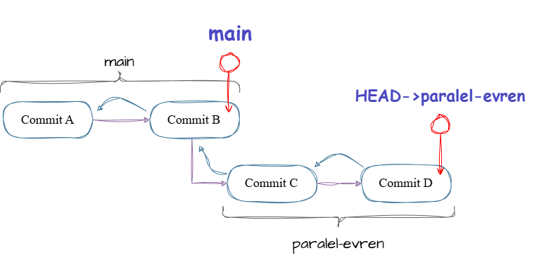
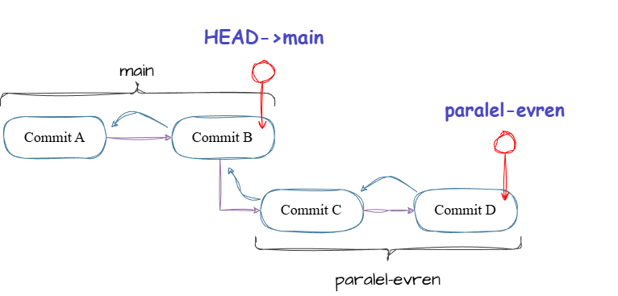
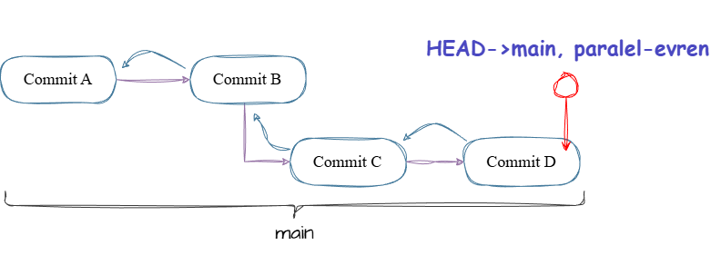
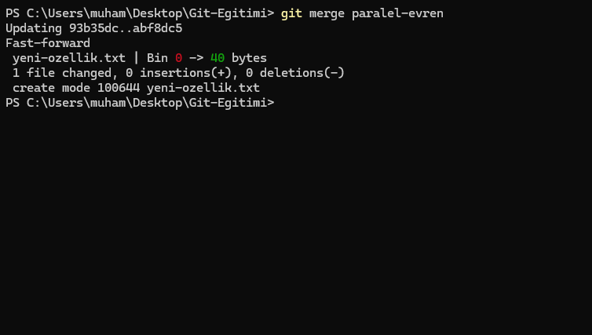
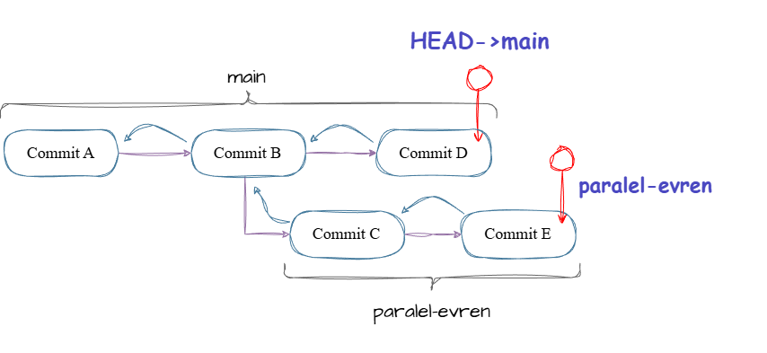
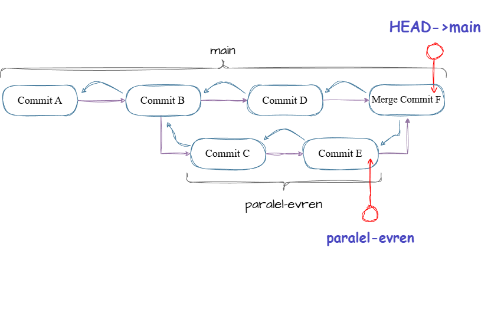

# 2.1 - Birleştirme Sanatı: Merge ve Conflict

> *"Ayrı dünyalarda (branchlerde) yaşasak da, sonunda hepimiz tek bir gerçeklikte (main) buluşacağız."*

Bir önceki bölümde evreni ikiye bölmüştük: **main** (Güvenli Bölge) ve **paralel-evren** (Deney Sahası).

Şu an `paralel-evren` dalında harika işler yaptığını, kodunu yazdığını ve test ettiğini varsayalım. Artık bu yenilikleri ana projeye, yani `main` dalına dahil etme vakti geldi. İşte bu işleme **Merging (Birleştirme)** diyoruz.

Git dünyasında birleştirme işlemi temelde iki ana biçimde gerçekleşir. Ancak bu süreç bazen merge conflict ile sonuçlanabilir. Gel bunları uygulayarak ve görselleştirerek anlayalım.

---

## Hazırlık: Röntgen Cihazını Kur (Git Tree)

Bu derste bol bol dallanıp budaklanacağız. Kör uçuş yapmamak ve *"Şu an neredeyim, kim kiminle birleşti?"* sorusunu anlık olarak cevaplamak için kendimize süper bir komut tanımlayalım.

Terminale şu sihirli satırı yapıştır:

```bash
git config --global alias.tree "log --graph --oneline --all --decorate"
```

> **Görev:** Bu derste yaptığın **her adımdan sonra** `git tree` komutunu çalıştır ve oluşan haritayı incele. Değişimi gözlerinle görmen çok önemli!

---

## Yöntem 1: Fast-Forward (Zahmetsiz Birleşme) ⏩

Eğer sen `paralel-evren` dalında çalışırken, ana dalda (`main`) kimse bir değişiklik yapmadıysa şanslısın. Git, teknik bir birleştirme yapmak yerine sadece **işaretçiyi (pointer) ileri kaydırır.**

Hadi bunu simüle edelim. `Git-Egitimi` (herhangi bir repo da olur) klasöründeysen başla:

**Adım 1: Paralel Evrene Geç ve Geliştirme Yap**

```bash
git switch paralel-evren
echo "Bu özellik harika" > yeni-ozellik.txt
git add .
git commit -m "feat: add super cool feature"
```

👉 *Şimdi `git tree` yap. `main` dalının geride kaldığını gördün mü?*

👇 **Şu an Arka Planda Durum Bu:**
*(Sen ilerledin, main geride kaldı)*

<picture>
<source media="(prefers-color-scheme: dark)" srcset="../../assets/2-Multiverse/Schemas/2.1-fastforward-branch-create-dark.drawio.png">
<source media="(prefers-color-scheme: light)" srcset="../../assets/2-Multiverse/Schemas/2.1-fastforward-branch-create-light.drawio.png">

</picture>

**Adım 2: Ana Evrene Dön** 

> [!WARNING]
> Her zaman **hedef** dal, bulunduğun dalla birleştirilir.

```bash
git switch main
```

👇 **Switch İşlemi:**
*(HEAD artık main'i gösteriyor, ama main hala eski yerde)*

<picture>
<source media="(prefers-color-scheme: dark)" srcset="../../assets/2-Multiverse/Schemas/2.1-fastforward-switch-main-dark.drawio.png">
<source media="(prefers-color-scheme: light)" srcset="../../assets/2-Multiverse/Schemas/2.1-fastforward-switch-main-light.drawio.png">

</picture>

**Adım 3: Birleştir (Fast-Forward)**

```bash
git merge paralel-evren
```

> **Terminal Çıktısı:** *"Fast-forward"* yazısını gördün mü?

👉 *Tekrar `git tree` yap. `main` ve `paralel-evren` artık aynı hizada, yan yana olmalı.*

👇 **Sonuç:**
*(Git, main etiketini aldı ve en ileriye, senin yanına taşıdı)*

<picture>
<source media="(prefers-color-scheme: dark)" srcset="../../assets/2-Multiverse/Schemas/2.1-fastforward-dark.drawio.png">
<source media="(prefers-color-scheme: light)" srcset="../../assets/2-Multiverse/Schemas/2.1-fastforward-light.drawio.png">

</picture>



Ve böylece `main` branch, yaptığın o şahane eklemelere sahip!

---

## Yöntem 2: True Merge (Non-Fast-Forward Merge)

Her zaman işler Fast-Forward kadar basit olmaz. Sen kendi dalında çalışırken, `main` dalında da başka geliştirmeler yapılmış olabilir. Bu durumda tarihçe **çatallanır.**

**Adım 1: Tarihçeyi Çatallaştıralım**

Önce yeni bir dal açıp orada bir ekleme yapalım:

```bash
git switch -c yeni-dal
echo "Yenilik ekliyorum" > yenilik.txt
git add .
git commit -m "feat: add new feature"
```

Bir de `main` dalında bir değişiklik yapalım:

```bash
git switch main
echo "Main güncellendi" > main-notu.txt
git add .
git commit -m "feat: add main note"
```

👉 *Hemen `git tree` yap. İki dalın birbirinden ayrıldığını (Y şeklini) görüyor musun?*

👇 **Şu an Durum Bu (Divergent / Çatallanmış History):**
*(İki taraf da farklı yönlere gitti)*

<picture>
<source media="(prefers-color-scheme: dark)" srcset="../../assets/2-Multiverse/Schemas/2.1-merge-branch-create-dark.drawio.png">
<source media="(prefers-color-scheme: light)" srcset="../../assets/2-Multiverse/Schemas/2.1-merge-branch-create-light.drawio.png">

</picture>

**Adım 2: Birleştir**
Git bu iki ucu bağlamak için **Merge Commit** oluşturacak.

```bash
git switch main      # Eğer mainde değilsen
git merge yeni-dal
```

> **Ne Oldu?** Terminalde bir editör açıldı. Git senden *"Merge branch 'yeni-dal'"* mesajını onaylamanı istiyor. Temiz bir mesaj yaz, kaydet ve çık.

👉 *Son kez `git tree` yap. İki dalın birleşip elmas şekli oluşturduğunu gör.*

👇 **Sonuç (Merge Commit):**
*(İki dal, yeni bir düğümle birbirine bağlandı)*

<picture>
<source media="(prefers-color-scheme: dark)" srcset="../../assets/2-Multiverse/Schemas/2.1-merge-branch-dark.drawio.png">
<source media="(prefers-color-scheme: light)" srcset="../../assets/2-Multiverse/Schemas/2.1-merge-branch-light.drawio.png">

</picture>

> Merge Commit, özel bir commit türüdür. Bu commitin 2 parenti vardır. Bu commit, iki farklı geçmişi tek bir zaman çizelgesinde “resmi olarak” birleştirmek için vardır.

> [!IMPORTANT]
> Her ne kadar `yeni-dal` branchını merge etsek de branch pointerı hala aynı commit üzerinde bekleyecektir. <br>
> Dilersen bu pointer'ı artık `git branch -d yeni-dal` ile silebilirsin.

> [!CAUTION]
> Eğer `git branch -d yeni-dal` ile branchı silemezsen bu, muhtemelen merging işleminde bir hata yaptığını gösterir. Git yaptıklarını kaybetmemek için seni uyaracaktır. <br>
> Yine de silmek istersen `git branch -D yeni-dal` yazabilirsin. Yine de dikkatli ol...

---

## Özel ama Sık Yaşanan bir Problem: Merge Conflict

Bu konu, en sık karşılaşacağın ama en önemli sorunlardan birisi. Yöntem 2'de Git otomatik birleştirdi çünkü dosyalar farklıydı. Peki ya **iki taraf da AYNI dosyanın AYNI satırını** değiştirdiyse? 

Git burada hakemliği bırakır: *"Ben kimin haklı olduğuna karar veremem. Seçimi sen yap."*

> [!IMPORTANT]
> Git arkandan dolap çevirmez ve bunun gibi tüm durumlarda seçim veya düzeltme yapmaz. Çünkü bu tarz durumlardaki seçimler kritik bir önem taşıyabilir. Taşımasa bile git, kullanıcının duruma hakimiyetine inanır ve ne yaptığını bildiğine inanır. <br><br>
> Git'in bu tutumu, kullanıcıya büyük bir güç ve esneklik sunar. Ancak bilmeyen ellerde kritik sorunlar doğurabilir. Neyse ki sen emin ellerdesin! 💜

## Hadi Kaos Yaratalım 💥

Çakışma yaratmak için önce **ortak bir geçmiş**, sonra da **bağımsız değişiklikler** gerekir.

**Adım 1: Ortak Bir Zemin Hazırla**
Main dalındayız. Önce dosyanın ilk halini oluşturalım.

```bash
echo "Renk: Siyah" > ayarlar.txt
git add .
git commit -m "feat: initialize settings"

```

**Adım 2: Tasarım Dalına Geç ve Rengi Değiştir**

```bash
git switch -c tasarim-dali
echo "Renk: Kırmızı" > ayarlar.txt
git add .
git commit -m "feat: change color to red"
```

**Adım 3: Main Dalına Dön ve Rengi Başka Bir Şey Yap**

```bash
git switch main
echo "Renk: Mavi" > ayarlar.txt
git add .
git commit -m "feat: change color to blue"
```

*(Şu an çatışma hazır: Ortak atada "Siyah"tı, ama biri "Kırmızı" yaptı, diğeri "Mavi".)*

**Adım 4: Birleştir**

```bash
git merge tasarim-dali
```

**İşte sonunda karşılaştın!** 💢

Terminal çıktılarını iyi oku, çünkü tanıyı koymadan tedaviye başlayamayız!

<details>
<summary>❓ "Dosyamda <<<<<<< işaretlerini göremiyorum?" (Windows/PowerShell Sorunu)</summary>

### Benim dosyamda conflict işaretleri yok?

Eğer terminalde şu uyarıyı alıyorsan:
`warning: Cannot merge binary files: ayarlar.txt (HEAD vs. tasarim-dali)`

**Sebep:** Windows PowerShell, `echo` komutunu kullanırken bazen dosyaları Git'in kafasını karıştıracak formatta kaydeder. Git, işleri mahvetmeyi asla sevmez ve dosyaya dokunmadan conflict olduğunu söyler.

**Çözüm 1: Bu durumu atlatalım**

1. Dosyayı VS Code'da aç.
2. İçindeki her şeyi sil.
3. `Renk: Mor` yazıp kaydet.
4. `git add .` ve `git commit -m "fix: encoding issue solved"` yazıp bu merge'ü bitir.

**Çözüm 2: Hadi şimdi GERÇEK Conflict deneyimi yaşayalım**
Binary sorununu çözdük ama Git'in meşhur işaretlerini göremedin. Gel şimdi dosyaları **elle (VS Code ile)** oluşturup bu deneyi tekrar yapalım.

**Aşağıdaki adımları sırasıyla uygula:**

1. **Temiz bir sayfa aç:**
Eski dosyayı silelim.

```bash
git switch main
rm ayarlar.txt
git branch -D tasarim-dali  # Eski dalı silelim
```

2. **Dosyayı VS Code ile oluştur (Temiz UTF-8 olsun):**
*(PowerShell echo komutunu kullanmayacağız)*

```bash
code ayarlar.txt
```

Açılan dosyaya `Renk: Siyah` yaz, kaydet ve kapat. Sonra:

```bash
git add .
git commit -m "feat: initialize settings"
```

3. **Tasarım Dalını Ayarla:**

```bash
git switch -c tasarim-dali
code ayarlar.txt
```

İçini `Renk: Kırmızı` yap, kaydet, kapat.

```bash
git add .
git commit -m "feat: change color to red"
```

4. **Main'e Dön ve Düzenle:**

```bash
git switch main
code ayarlar.txt
```

İçini `Renk: Mavi` yap, kaydet, kapat.

```bash
git add .
git commit -m "feat: change color to blue"
```

5. **VE FİNAL:**

```bash
git merge tasarim-dali
```

*İşte şimdi `ayarlar.txt` dosyasına baktığında o meşhur conflict işaretlerini göreceksin!* 🎉

</details>

### Çözüm: Cerrah Gibi Müdahale Etmek

Eğer yukarıdaki adımları geçtiysen ve elinde gerçek bir conflict varsa, `ayarlar.txt` dosyasını VS Code ile aç.

> Editör VS Code olmak zorunda değil. Ancak VS Code moderndir, çoğu sorunda işleri kolaylaştırır. Başarabilen terminalden bile yapabilir!

Git şu an dosyayı fiziksel olarak işaretledi.

**Durum A: Modern VS Code Görünümü**
Kodun üzerinde *"Accept Current Change"* (Mevcudu Kabul Et) veya *"Accept Incoming Change"* (Geleni Kabul Et) gibi renkli butonlar görürsün. İstediğin butona basarak seçimi yapabilirsin.

**Durum B: Klasik Görünüm (Raw)**
VS Code buton göstermezse (veya `cat ayarlar.txt` dersen) şöyle bir yazı görürsün:

```text
<<<<<<< HEAD
Renk: Mavi
=======
Renk: Kırmızı
>>>>>>> tasarim-dali
```

* `<<<<<<< HEAD`: Senin olduğun yer (Main -> Mavi).
* `=======`: Ayrım çizgisi.
* `>>>>>>> tasarim-dali`: Gelen değişiklik (Tasarım -> Kırmızı).

**Karar Ver:**
Oklardan (`<<<<`, `====`) kurtul, dosyayı temizle ve son kararını yaz:

```bash
Renk: Mor # Bu arada buraya konuyla tamamen alakasız bir şey bile yazabilirsiniz.
```

### Final: Birleştirmeyi Tamamlayalım

Conflict çözümü manuel bir işlemdir, sonunda Git'e bittiğini söylemelisin.

1. **Kaydet ve Stage Et:**

```bash
git add ayarlar.txt
```

2. **Commitle:**
Merge conflict çözümleri, merge’i tamamlamak için yeni bir commit gerektirir.

```bash
git commit -m "fix: resolve conflict (blue + red = purple)"
```

Tebrikler Mühendis! Az önce Git dünyasının en korkulan canavarını ellerinle evcilleştirdin. Şimdilik >:)

> Basitti değil mi? Peki ya karşına 10000 satırlık bir dosya çıksa? Teker teker uğraşman mı gerek gerçekten? Göreceğiz...

---

## Özet: Merge Commit Anatomisi

Az önce Senaryo 2 ve Senaryo 3'te oluşan o "Düğüm Commit", Git tarihçesinde **iki ebeveyni (parent) olan** özel bir committir. Grafiğe baktığında elmas şeklini görürsün.

```text
            * (Merge Commit) İki dal burada birleşti
            |\
            | * (Yeni-Dal / Tasarim-Dali)
(Main Dal)  * |
            |/
            * (Ortak Ata)
```

🎉 **Tebrikler!** Artık hem evrenleri ayırmayı (Branch) hem de kaos çıkmadan birleştirmeyi (Merge) biliyorsun.

Sırada; tarihçeyi ütüleyip dümdüz yapan (Rebase), işi yarım bırakıp gitmeni sağlayan (Stash) ve başka daldan tek bir commiti çalan (Cherry-Pick) yöntemler var.

👉 **Sırada:** [2.2 - Gelişmiş Branching: Rebase, Stash ve Cherry-Pick](./2.2-gelismis-branching.md)