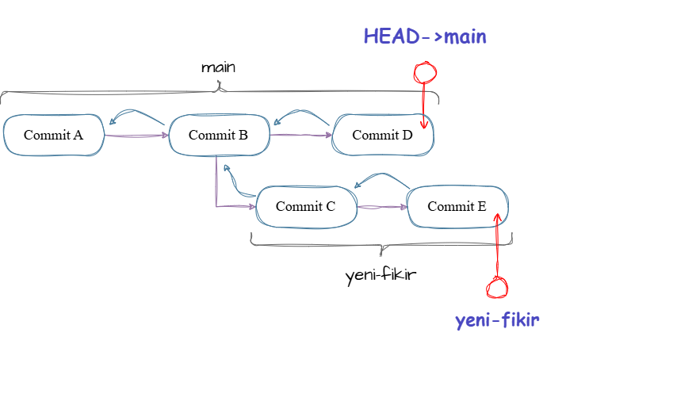
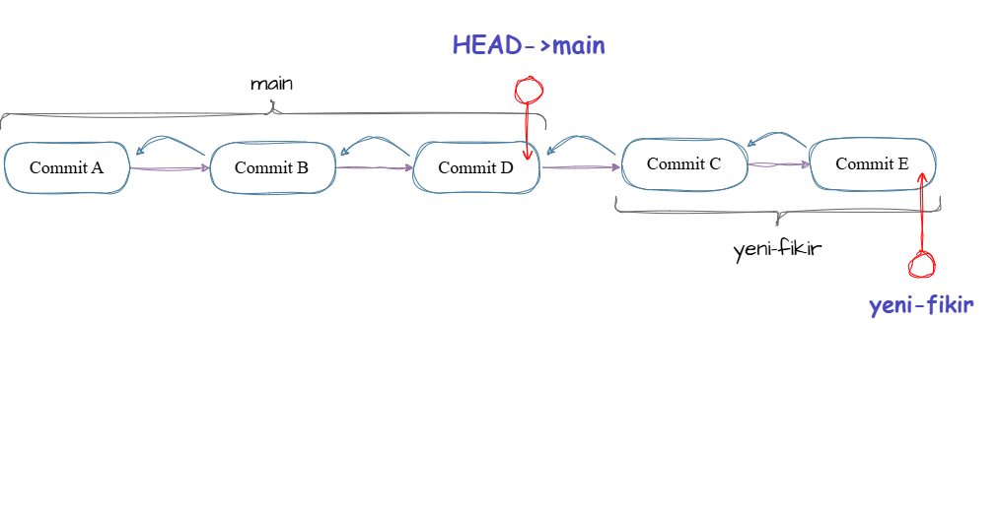
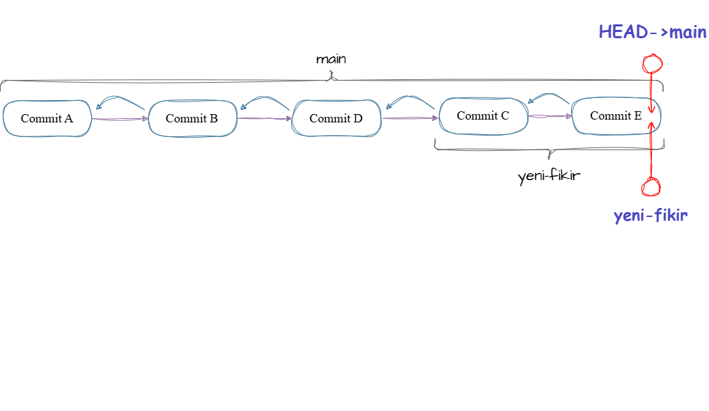

# 2.2 - Gelişmiş Zaman Yolculuğu: Stash, Rebase ve Cherry-Pick 🧰

> *"Gerçek bir Git ustası, sadece tarih yazan değil; tarihi istediği gibi yeniden şekillendirebilen kişidir."*

Geçen derste paralel evrenleri (branchleri) çarpıştırıp (merge) tek bir gerçeklikte buluşturmayı öğrendik. Ancak gerçek dünyada işler her zaman o kadar temiz ilerlemez. Bazen işi yarım bırakıp gitmen gerekir, bazen tarihçenin spagetti gibi görünmesini istemezsin, bazen de koca bir daldan sadece tek bir commit'i "çalmak" istersin.

İşte seni standart bir kullanıcıdan, bir "Git Büyücüsü"ne dönüştürecek o kutsal üçlü.

---

## 1. Git Stash: Yarım Kalan İşleri Zulalamak 🎒

`yeni-ozellik` dalında harıl harıl kod yazıyorsun. Kod çalışmıyor, her şey yarım yamalak. O sırada takım liderinden acil bir mesaj geldi: *"Main dalında kritik bir hata var, hemen geçip düzeltmen lazım!"*

Dal değiştirmek (switch) istiyorsun ama Git sana kızıyor: *"Önce elindeki işleri commit'le, öyle git!"*
Ama elindeki iş bozuk, commit atmak istemiyorsun. Ne yapacaksın?

İşte **Stash** (Zula/Cep), tam olarak bu anlar içindir. Yaptığın değişiklikleri geçici bir cebe koyar, çalışma alanını temizler ve sana temiz bir geçiş imkanı sunar.

### Hadi Deneyelim

**Adım 1: Yarım Kalan Bir İş Yarat**
```bash
git switch main
echo "Yarim kalan kodlar..." > deney.txt
git add .
```

*(Şu an dosya Staging Area'da ama commitlenmedi. İşimiz yarım.)*

**Adım 2: Zula'ya At (Stash)**

```bash
git stash
```

> **Terminal:** *"Saved working directory and index state WIP on main..."*

Şimdi klasörüne bak, `deney.txt` içindeki değişiklikler puf oldu! Çalışma alanın artık tertemiz. Gidip acil işini (veya dal değişimini) halledebilirsin.

**Adım 3: İşleri Geri Getir (Pop)**
Acil işin bitti ve yarım bıraktığın koda geri dönmek istiyorsun.

```bash
git stash pop
```

*(Bam! Yarım kalan kodların aynen bıraktığın gibi geri geldi.)*

> [!TIP]
> `git stash list` ile zuladaki tüm işlerini görebilir, `git stash drop` ile gereksiz zulaları silebilirsin. `pop` komutu, işi hem geri getirir hem de zuladan siler. Eğer zuladan silinmeden geri gelmesini istersen `git stash apply` kullanabilirsin.

> [!NOTE]
> **Untracked Dosyalara Ne Olacak?**
> Standart `git stash` komutu, sadece Git'in önceden tanıdığı (takip ettiği) dosyalardaki değişiklikleri saklar. Zaten bu yüzden `git add .` demiştik. Eğer projeye **yepyeni bir dosya** eklediysen, stagelemediysen ve ortalığı tamamen temizlemek istiyorsan sihirli komut şudur: 
> `git stash -u` (Untracked - Takip edilmeyen dosyaları da zulaya at!)
---

## 2. Git Rebase: Tarihi Ütülemek 📏

`Merge` komutu harikadır ama bir bedeli vardır: Tarihçede "Elmas" şekilleri (çatallanmalar) bırakır. Proje büyüdükçe `git tree` ekranı metro haritasına döner.

`Rebase` (Yeniden Temellendirme) ise, senin dalının başlangıç noktasını alır ve ana dalın (`main`) **en ucuna** taşır. Sanki ana daldaki değişiklikler sen işe başlamadan *önce* yapılmış gibi tarihi baştan yazar.

### Uygulamalı Simülasyon

**Adım 1: Ortak Bir Geçmiş Yarat**

```bash
git switch main
echo "Ortak Zemin" > zemin.txt
git add .
git commit -m "init: ortak zemin"
```

**Adım 2: Yan Dalda Bir Şeyler Yap (Geçmişte Kaldı)**

```bash
git switch -c yeni-fikir
echo "Yeni Fikir" > fikir.txt
git add .
git commit -m "feat: yeni fikir eklendi"
```

**Adım 3: Main Dalı İlerlesin**

```bash
git switch main
echo "Main Ilerledi" > main-ilerleme.txt
git add .
git commit -m "feat: main ilerledi"
```

*(Şu an `yeni-fikir` dalı, `main`'in gerisinde kaldı. Tarihçe Y şeklinde çatallandı.)*

👉 *Hemen `git tree` yapıp o çatallanmayı gör!*

<picture>
<source media="(prefers-color-scheme: dark)" srcset="../../assets/2-Multiverse/Schemas/2.2-rebase-before-dark.drawio.png">
<source media="(prefers-color-scheme: light)" srcset="../../assets/2-Multiverse/Schemas/2.2-rebase-before-light.drawio.png">

</picture>

**Adım 4: Rebase Zamanı (Tarihi Baştan Yaz)**
Şimdi `yeni-fikir` dalına geçip, onun temelini `main`'in en güncel haline taşıyacağız.

```bash
git switch yeni-fikir
git rebase main
```

👉 *Tekrar `git tree` çalıştır!* Normalde çatallanması gereken dalların, tek bir düz çizgi halinde sıralandığını göreceksin. Senin `yeni-fikir` commitin, koparılıp `main` commitinin tam üzerine yerleşti.

> [!NOTE]
> **Peki Arka Planda Ne Oldu?** Aslında senin eski commit'lerin fiziksel olarak uçup gitmedi. Git, senin `yeni-fikir` dalındaki commitlerinin tıpatıp aynısını kopyaladı, onlara yepyeni kimlikler (Hash ID) verdi ve `main`'in üzerine yapıştırdı. Sanki en başından beri `main` üzerinde çalışmışsın gibi! Ne zekice değil mi?

*(Not: Şu an sadece `yeni-fikir` dalı ileriye taşındı. `main` hala eski yerinde bekliyor.)*

<picture>
<source media="(prefers-color-scheme: dark)" srcset="../../assets/2-Multiverse/Schemas/2.2-rebase-after-dark.drawio.png">
<source media="(prefers-color-scheme: light)" srcset="../../assets/2-Multiverse/Schemas/2.2-rebase-after-light.drawio.png">

</picture>

**Adım 5: Main'i İleri Sar (Fast-Forward)**
Rebase yaparak çatallanmayı yok ettik ve kusursuz bir Fast-Forward zemini hazırladık. Şimdi bu emeği `main`'e katalım:

```bash
git switch main
git merge yeni-fikir
```

👉 *Son kez `git tree` yap. `main` ve `yeni-fikir`'in en tepede, aynı noktada buluştuğunu ve tarihçenin jilet gibi dümdüz kaldığını gör! (Merge commit oluşmadı)*

<picture>
<source media="(prefers-color-scheme: dark)" srcset="../../assets/2-Multiverse/Schemas/2.2-fastforward-dark.drawio.png">
<source media="(prefers-color-scheme: light)" srcset="../../assets/2-Multiverse/Schemas/2.2-fastforward-light.drawio.png">

</picture>

<details>
<summary>🐙 Hali Hazırda GitHub Kullanıyorum!</summary>

GitHub kullanmak harika bir adım! O halde sana rebase ile GitHub arasındaki hassas ilişkiden bahsedeyim. (¬‿¬)

GitHub, projeni koruyan bir veri merkezidir. Oraya her zaman temiz ve güvenli kodların gitmesini istersin. Ancak **Rebase**, commitlerin kimliklerini (HASH'lerini) baştan aşağı değiştirir.

Eğer rebase yaptığın bir ortak branch’i GitHub’a push etmeye kalkarsan, Git geçmiş uyuşmazlığı nedeniyle push’u reddeder. *"Senin gönderdiğin geçmişle, benim elimdeki geçmiş uyuşmuyor!"* der.

İşte böyle durumlarda **Force Push** (`git push --force`) atmak zorunlu hale gelir. Force Push GitHub'a şunu emreder: *"Eski tarihi unut, onu ez ve benim sana gönderdiğim bu yeni gerçekliği kabul et!"*

Ancak **dikkatli olmalısın!** Eğer elindeki versiyon hatalı veya eksikse, `force push` ile GitHub'daki sağlam kopyayı kalıcı olarak silebilirsin. Paranoyak olmana gerek yok, sadece neyi ezdiğini bilmende fayda var.

</details>

> [!CAUTION]
> **Rebase'in Altın Kuralı:** Başkalarıyla paylaştığın (örneğin GitHub'a gönderdiğin) ortak bir dalda ASLA rebase yapma! Rebase, geçmişi değiştirir. Eğer takımınla paylaştığın ortak bir geçmişi değiştirirsen, arkadaşlarının bilgisayarındaki proje ile senin projen uyuşmaz hale gelir. Ortaya tam bir kaos çıkar! Rebase'i sadece kendi bilgisayarındaki, henüz kimseyle paylaşmadığın gizli dallarında kullan. Böylece pushlarken yeni özellik pushlar gibi rahatça gönderebilirsin!

> [!IMPORTANT]
> **Kuralları Yıkmak Gerekirse:** Bazen takımca anlaşıp ana projenin (`main`) geçmişini baştan aşağı temizlemek isteyebilirsiniz. Eğer ortak bir dalda mecburen rebase yapacaksanız, tüm takıma haber vermelisiniz! Çünkü herkesin kendi bilgisayarındaki eski projeyi çöpe atıp, senin yarattığın bu "yeni gerçekliği" baştan indirmesi gerekir. Habersiz yapılan bir zaman yolculuğu (rebase), takımın saatlerce süren emeğini yok edebilir!

---

## 3. Git Cherry-Pick: Nokta Atışı Hırsızlık 🍒

Bazen paralel bir evrende (başka bir dalda) 10 tane commit atılmıştır ama sana o daldan sadece **tek bir özellik (tek bir commit)** lazımdır. Koca dalı `merge` etmek istemezsin.

İşte `cherry-pick` (cımbızla almak), o dalın sadece istediğin commitini alır ve senin bulunduğun dala kopyalar.

### O Commiti Çalalım!

**Adım 1: Hedef Dalda Bir Sürü Commit Olsun**
Önce `yeni-fikir` dalına geçip bir commit daha atalım.

```bash
git switch yeni-fikir
echo "Mukemmel bir fonksiyon" > mukemmel.txt
git add .
git commit -m "feat: harika otesi fonksiyon"
```

👉 *Şimdi `git log --oneline` yazıp bu son attığımız commitin HASH'ini (ilk 7 harfini, örn: a1b2c3d) kopyala.*

**Adım 2: Main Dalına Geç ve Çal!**

```bash
git switch main
git cherry-pick <KOPYALADIGIN_COMMIT_HASH_BURAYA>
```

Harika! `yeni-fikir` dalındaki diğer gereksiz şeyleri almadın, sadece sana lazım olan o sihirli commit'i `main` dalına kopyaladın. `git tree` ile kontrol edebilirsin.

> [!NOTE]
> `cherry-pick` de commit’i yeniden oluşturur. Yani kopyalanan commit, orijinal commit ile aynı içeriğe sahip olsa bile yeni bir hash’e sahip olur.

> [!TIP]
> Artık yeniden oluşturulan commit’lerin hash’lerinin neden değiştiğini anlayacak içgörüye sahipsin. Commit’lerin eşsizliği ilkesi Git’in temel taşlarından biridir. Her commit; author bilgisi, commit date’i, parent commit’i ve mesajı gibi metadata’lar içerir. Bu alanların tamamının birebir aynı olması neredeyse imkânsızdır. Dolayısıyla commit yeniden üretildiğinde hash’in değişmesi kaçınılmazdır.

---

👉 **Sırada:** [2.3 - Kökü Olmayan Dallar: Orphan Branches](./2.3-orphan-branches.md)