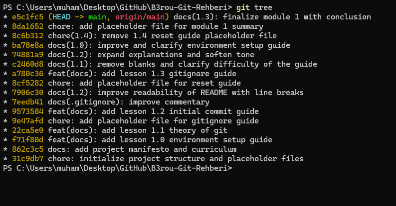
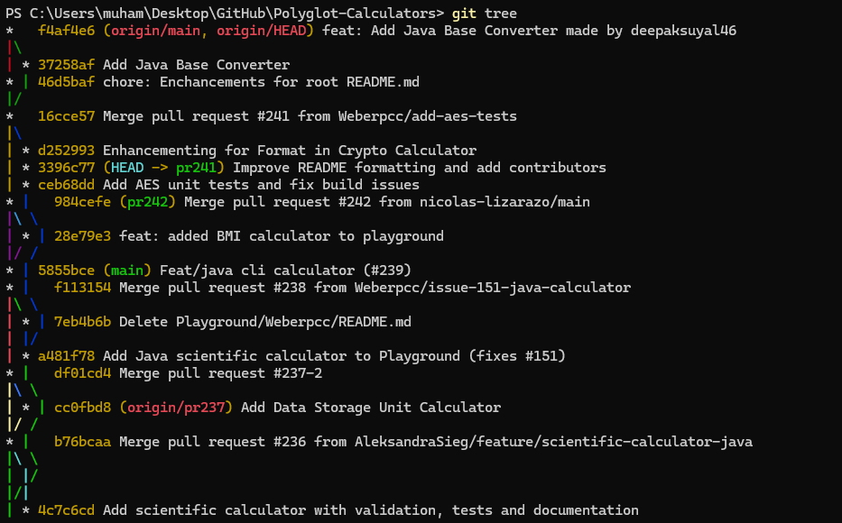

# Multiverse: Bölüm Özeti 🌌

> *"Zamanla oynamak tehlikelidir, ancak kuralları bilirseniz paralel evrenlerin efendisi olursunuz."*

Bu belge, **Bölüm 2: Multiverse** kapsamında öğrendiğimiz gelişmiş Git komutlarının, zaman yolculuğu tekniklerinin ve kavramların özetidir.

---

## 1. Paralel Evrenler (Branching)

Ana projeye dokunmadan, güvenli ve izole bir alanda çalışmak için kullandığımız komutlar.

| Komut | Açıklama |
| --- | --- |
| `git branch` | Mevcut lokal branch'leri listeler. Yıldızlı (`*`) olan, şu an bulunduğun branch'tir. |
| `git branch <isim>` | Belirtilen isimde yeni bir branch oluşturur (ama o branch'e geçmez). |
| `git switch <isim>` | Belirtilen branch'e geçiş yapar. |
| `git switch -c <isim>` | Yeni branch'i **oluşturur** ve hemen ona **geçiş yapar** (En sık kullanılan). |
| `git switch --orphan <isim>` | Geçmişi (tarihçesi) tamamen boş, diğer branch'lerden bağımsız yepyeni bir branch oluşturur. |
| `git branch -d <isim>` | Belirtilen branch'i siler. (Sadece merge edilmiş, işi bitmiş branch'leri siler). |
| `git branch -D <isim>` | Belirtilen branch'i zorla siler (İçindeki commitler merge edilmemiş olsa bile). |

---

## 2. Evrenleri Entegre Etmek (Merging)

Farklı branch'lerdeki çalışmaları ana projede (veya başka bir branch'te) bir araya getirme.

> [!WARNING]
> Merge komutu her zaman **hedef** branch'te çalıştırılır. (Örn: `tasarim` branch'ini `main`'e merge etmek istiyorsan, önce `main`'e geçmelisin).

| Komut | Açıklama |
| --- | --- |
| `git merge <branch_ismi>` | Belirtilen branch'i, şu an bulunduğun branch'e entegre eder (Fast-Forward veya Merge Commit ile). |
| `git merge --abort` | **Panik Butonu!** Conflict (çakışma) çıktığında işin içinden çıkamazsan, işlemi tamamen iptal edip merge öncesi duruma dönmeni sağlar. |
| `git merge <isim> --allow-unrelated-histories` | Ortak bir atası (parent) olmayan iki bağımsız branch'i (örn. orphan branch) zorla merge eder. |

---

## 3. Gelişmiş Zaman Yolculuğu ve Temizlik

Tarihi yeniden yazmak, commit çalmak, yarım kalan işleri zulalamak ve reponun bahar temizliğini yapmak için kullandığımız komutlar.

| Komut | Açıklama |
| --- | --- |
| `git stash` | Çalışma alanındaki (henüz commitlenmemiş) değişiklikleri geçici bir cebe koyar ve etrafı temizler. |
| `git stash -u` | Standart stash'in görmediği **yepyeni (untracked)** dosyaları da zulaya atar. |
| `git stash pop` | Zuladaki işleri çalışma alanına geri getirir ve zuladan siler. |
| `git stash list` / `drop` | Zuladaki kayıtları listeler / İşi biten bir zulayı kalıcı olarak çöpe atar. |
| `git clean -fdx` | **Nükleer Seçenek:** Git'in takip etmediği (untracked) veya ignore ettiği her şeyi çalışma alanından kalıcı olarak siler. |
| `git rebase <branch_ismi>` | Bulunduğun branch'in başlangıç noktasını kökünden söker ve belirtilen branch'in en ucuna ekler (Tarihi düz bir çizgiye çevirir). |
| `git cherry-pick <hash>` | Başka bir branch'teki spesifik bir commit'i (örneğin `a1b2c3d`) kopyalayıp, senin bulunduğun branch'e yapıştırır. |

> [!TIP]
> **Röntgen Cihazını Unutma!**  
> Kafan karıştığında, kim nerede, hangi branch nereye gitmiş görmek için her zaman şu komutu kullan:  
> `git tree` (Eğer Bölüm 1'deki alias ayarını yaptıysan, sana tüm evrenlerin haritasını renkli çizecektir.)

**Rebase ile Ütülenmiş (Linear) Tarihçe Böyle Görünür:**

**Merge ile Birleştirilmiş (Branchy/Çatallı) Tarihçe Böyle Görünür:**

---

## 4. Bölümde Geçen Kavramlar Sözlüğü

> [!TIP]
> Teknik mülakatlarda veya takım içi konuşmalarda bu kelimeleri doğru kullanmak, senin bir "Junior"dan ziyade ne yaptığını bilen bir mühendis olduğunu gösterir.

* **Branch:** Projenin ana tarihçesinden bağımsız, paralel çalışma alanları.
* **Orphan Branch:** Diğer branch'lerle hiçbir bağ (ortak ata) paylaşmayan, geçmişi bomboş olan bağımsız çalışma alanı.
* **HEAD:** Git'in işaretçisidir. O an projede **tam olarak nerede (hangi branch'te veya hangi commit'te)** olduğunu gösterir.
* **Fast-Forward:** İki branch'i birleştirirken, hedef branch'te hiçbir yeni değişiklik yoksa, Git'in yeni bir commit yaratmak yerine sadece HEAD işaretçisini ileriye taşıdığı zahmetsiz merge türü.
* **Merge Commit:** İki farklı geçmişi (diverged history) tek bir zaman çizelgesinde birleştirmek için oluşturulan, **iki adet ebeveyne (parent)** sahip özel bir commit.
* **Merge Conflict (Çakışma):** İki farklı branch'te, aynı dosyanın aynı satırlarında farklı değişiklikler yapıldığında Git'in hakemliği sana bıraktığı durum.
* **Stash:** Yarım kalan işleri, branch değiştirebilmek veya acil bir işe bakabilmek için geçici olarak sakladığımız alan.
* **Untracked Dosya:** Git'in henüz takip etmediği, yani `git add` ile sahneye eklenmemiş dosyalar.
* **Rebase:** Bir branch'i alıp, başka bir branch'in güncel ucuna "yeniden temellendirme" işlemi. Hash'leri değiştirir, geçmişi baştan yazar.
* **Cherry-Pick:** İhtiyacın olan tek bir commit'i (özelliği) koca bir branch'i merge etmeden, nokta atışı olarak kopyalayıp kendi branch'ine alma işlemi.
* **Force Push (`--force`):** Uzak sunucudaki (GitHub) tarihçeyi, senin lokal bilgisayarındaki tarihçe ile ezmeye zorlayan komut. Güçlü ama tehlikelidir!
* **Allow Unrelated Histories:** Ortak bir atası olmayan iki bağımsız branch'i (örn. orphan branch) zorla merge etmek için kullanılan parametre.

---

### B3rou'nun Tavsiyesi:

> Conflict (çakışma) ekranını ilk gördüğünde o `<<<<<<<` işaretleri çok korkutucu gelebilir. Derin bir nefes al, terminalin sana ne söylediğini oku ve editörünü aç. Git hiçbir dosyayı silmez veya bozmaz, sadece sana seçenek sunar. Ne de olsa kontrol **tamamen** senin ellerinde!

👉 **Sonraki Bölüme Geç:** [3.0 - Remote: GitHub ile Dans](../3-remote/3.0-remote-temelleri.md)